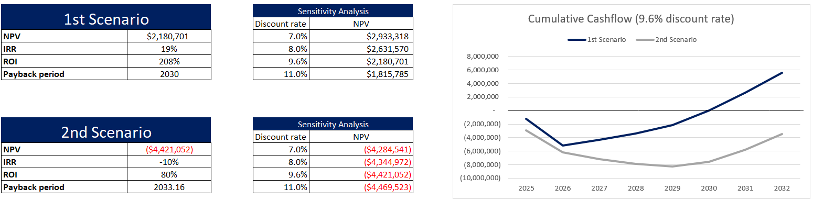

# Capital Budgeting
## Project Overview

Given raw financial data I **evaluated two development scenarios to determine the best financial option.**

## Scenarios

### Assumptions for the 1st scenario

**Project:** to build a factory, including buildings and machine tools required for production.

**Increase in sales:** It is planned that after the implementation of the project, the sales volumes will increase by 50% from the current ones and should continue to increase by 10% annually.

**Cost:** An additional 10 people with an average salary of the company will be needed to service the new production capacity.

**Costs:** Marketing budgets would need to be further adjusted to maintain projected sales growth.

**Duration of the project:** 2 years.

### Assumptions for the 2nd scenario

**Project:** will carry out active marketing activities and develop a digital product.

**Increase in sales:** Sales are expected to grow by 30% during the campaign every year. In subsequent periods, growth is expected to fall to 15%.

**Cost:** The provision and development of services will require the hiring of 10 people with 2x the average salary of the company, starting in the first year.

**Costs:** After the campaign ends, advertising budgets are expected to fall to € 1 million per year.

**Duration of the project:** 2 years.

## Actions Taken

Calculated NPV and IRR and Payback Period for both scenarios

Projected cash flows and costs using raw financial data

Compared scenarios to recommend the optimal investment

## Results

- **I chose 8 years evalution to see the full financial impact and long-term results of the projects.** This period helps show true profitability and payback time.
- **The 1st scenario (manufacturing expansion)** shows a **positive NPV of $ 2.2M** and an IRR of 19%, indicating strong financial viability. **This scenario should be approved.**
- **The 2nd scenario (digital product + marketing)** performs very poorly — with a **highly negative NPV of - $ 4.4M,** negative IRR of –10%. **This scenario should not be aprroved.**

